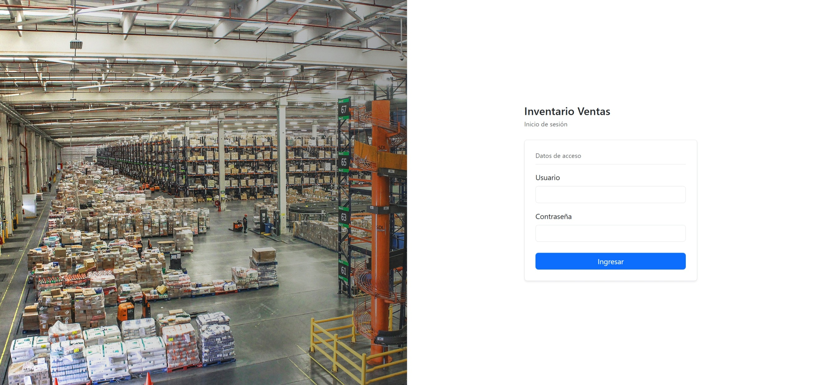
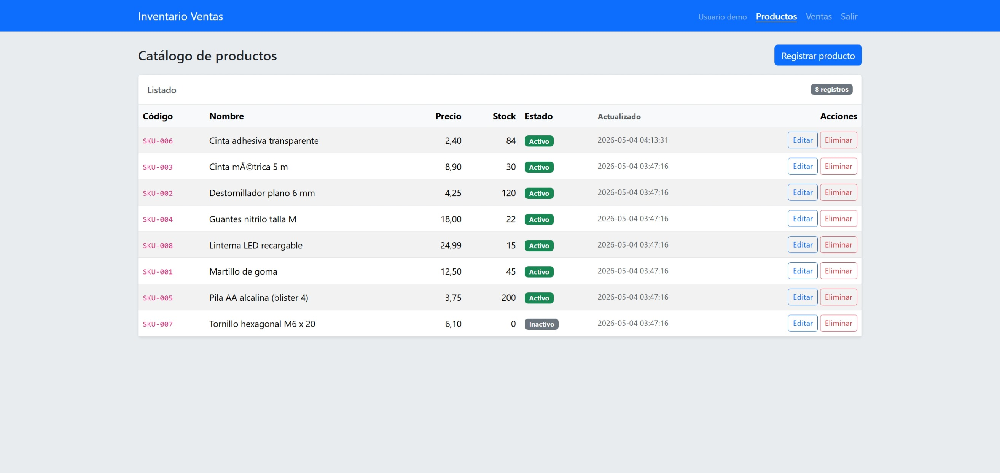
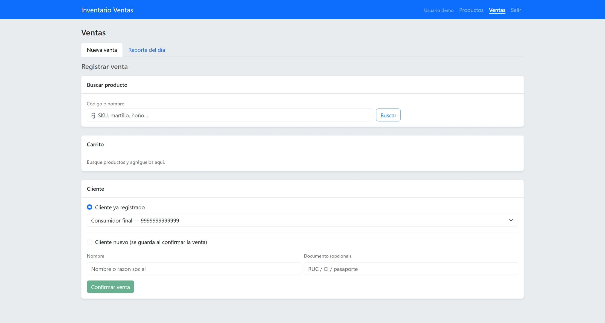
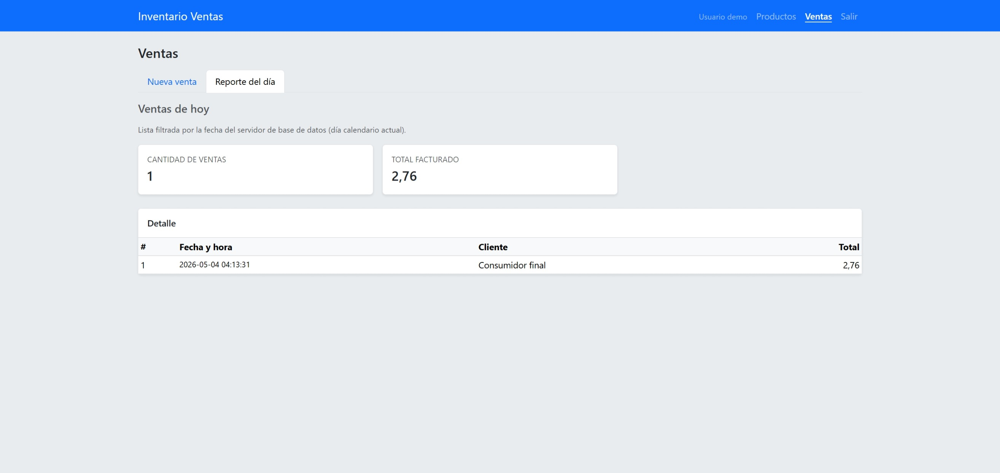

# InventarioVentasSimple

Sistema web en **PHP** para **gestión de productos** (CRUD) y **registro de ventas**, con persistencia en **MySQL**, interfaz con **Bootstrap 5**, autenticación por sesión y estructura por capas (controlador → servicio → modelo → vista).

---

## Descripción del sistema

- **Productos:** alta, listado, edición y baja lógica mediante formularios y validaciones en servidor. Código único por producto, control de stock y estado activo/inactivo.
- **Ventas:** búsqueda de productos, carrito en sesión, selección de cliente (existente o nuevo), cálculo de subtotal, IVA (porcentaje configurable en base de datos) y total. Al confirmar se registra la venta, el detalle y se descuenta stock.
- **Reporte del día:** pestaña en la pantalla de ventas con resumen y listado de ventas del día según la fecha del servidor MySQL.
- **Seguridad básica:** inicio de sesión con contraseña almacenada con hash (`password_hash` / `password_verify`). Las páginas de productos y ventas exigen sesión válida.

> **Persistencia:** los datos del sistema (productos, clientes, ventas, usuarios, parámetros) se guardan en **MySQL** mediante PDO. No se utiliza `localStorage` en el navegador para el CRUD de productos ni para las ventas.

---

## Tecnologías y estructura del proyecto

| Capa / recurso | Detalle |
|----------------|---------|
| Lenguaje | PHP 8.3 (`declare(strict_types=1)`) |
| Servidor | Apache (contenedor Docker) |
| Base de datos | MySQL 8.0, PDO |
| Frontend | HTML, Bootstrap 5, jQuery (validación ligera en login) |
| Contenedores | `docker-compose.yml` (servicios `php` y `mysql`) |

**Estructura de carpetas (resumen):**

```
config/           # Conexión PDO (variables de entorno)
controllers/      # ProductoController, VentaController
database/         # Script SQL de esquema y datos iniciales (inventario.sql)
docker/           # Dockerfile PHP y VirtualHost Apache
models/           # Entidades (p. ej. Producto)
public/           # Punto de entrada web (DocumentRoot): index.php, productos.php, ventas.php, assets/
services/         # Lógica de negocio y acceso a datos
```

---

## Requisitos

- **Docker Desktop** (o Docker Engine + Docker Compose v2) instalado y en ejecución.
- Navegador moderno (Chrome, Edge, Firefox).
- Opcional: cliente MySQL (DBeaver, CLI `mysql`) para inspeccionar la base en el puerto publicado.

**Puertos por defecto** (definidos en `docker-compose.yml`; cámbielos si chocan con otros servicios):

| Servicio | URL / host | Puerto host |
|----------|------------|---------------|
| Aplicación web | http://localhost:8888 | `8888` → 80 en el contenedor PHP |
| MySQL | `127.0.0.1` | `3310` → 3306 dentro de la red Docker |

Dentro de Docker, PHP se conecta a MySQL con host `mysql` y puerto `3306` (no use `3310` dentro del contenedor PHP).

---

## Instalación y puesta en marcha

### 1. Clonar el repositorio

```bash
git clone <URL-de-su-repositorio-GitHub>.git
cd InventarioVentasSimple
```

### 2. Levantar los contenedores

En la raíz del proyecto:

```bash
docker compose up -d --build
```

Espere a que MySQL pase a **healthy** (el servicio `php` depende de ello). La primera vez se importa automáticamente `database/inventario.sql` si el volumen de datos es nuevo.

### 3. Abrir la aplicación

En el navegador: **http://localhost:8888/**

- Redirige al login si no hay sesión.
- Tras autenticarse, la aplicación envía por defecto a **Ventas**.

### 4. (Opcional) Variables de entorno

Puede copiar `.env.example` a `.env` y ajustar valores. El contenedor PHP ya recibe `DB_*` desde `docker-compose.yml`; un archivo `.env` en el host **no** se inyecta solo en PHP salvo que configure un mecanismo adicional. Para el desarrollo actual basta con el `docker-compose.yml`.

---

## Usuario de prueba

| Campo | Valor |
|--------|--------|
| **Usuario** | `demo` |
| **Contraseña** | `demo` |

Definido en `database/inventario.sql` (tabla `usuarios`, hash bcrypt). Tras el primer arranque con volumen nuevo, el usuario ya existe.

---

## Base de datos

El repositorio incluye un único script: **`database/inventario.sql`**.

| Archivo | Uso |
|---------|-----|
| `database/inventario.sql` | Esquema completo y datos iniciales (productos, clientes, parámetros de IVA, usuario demo, tablas de ventas y detalle). Docker Compose lo monta en `/docker-entrypoint-initdb.d/` del contenedor MySQL **solo la primera vez** que se crea el volumen de datos. |

**Consideraciones importantes:**

1. **Volumen persistente:** si cambia `MYSQL_PASSWORD` en `docker-compose.yml` pero el volumen ya existía, MySQL puede conservar la contraseña anterior → error de acceso. Solución habitual: recrear el volumen (`docker compose down -v` y `docker compose up -d`; **se pierden datos locales**) o ajustar manualmente el usuario `inventario` en MySQL como `root` para que coincida con el compose.
2. **UTF-8:** el esquema usa `utf8mb4` para soportar caracteres completos en español y otros símbolos.
3. **IVA:** el porcentaje se lee de la tabla `parametros`, clave `iva_porcentaje` (por defecto 15 en el script inicial).

---

## Validaciones (módulo productos)

Reglas aplicadas en modelo/servidor (`Producto::validar()` y datos enviados por formulario):

- **Código:** obligatorio (y único en base de datos).
- **Nombre:** obligatorio (no vacío).
- **Precio:** debe ser **estrictamente mayor que cero** (no se acepta precio 0 ni negativo).
- **Stock:** entero **mayor o igual a cero** (no se permiten valores negativos).

El formulario HTML incluye restricciones auxiliares (`required`, `min` en número) que refuerzan la experiencia de usuario; la validación definitiva es en **servidor**.

---

## Capturas del sistema

Las imágenes siguientes corresponden a la interfaz del proyecto (archivos en `docs/capturas/`).

### Inicio de sesión

Pantalla de acceso (`index.php`): título del sistema, formulario de usuario y contraseña, botón **Ingresar** y panel visual con imagen de almacén.



### Catálogo de productos

Listado del CRUD de productos (`productos.php`): tabla con código, nombre, precio, stock, estado (activo/inactivo), fecha de actualización y acciones **Editar** / **Eliminar**; botón **Registrar producto**.



### Nueva venta

Módulo de ventas, pestaña **Nueva venta** (`ventas.php`): búsqueda por código o nombre, carrito, selección de cliente (registrado o nuevo) y **Confirmar venta**.



### Reporte del día

Misma pantalla de ventas, pestaña **Reporte del día**: resumen (cantidad de ventas y total facturado) y tabla de detalle con número de venta, fecha y hora, cliente y total.



> **Codificación:** la aplicación y la base usan UTF-8 (`utf8mb4`). Si alguna captura o herramienta externa muestra caracteres raros en tildes, suele ser un tema de visualización o exportación, no del código en ejecución con charset correcto.

---

## Dependencias de terceros (incluidas en el repositorio)

- **Bootstrap 5** y **jQuery** (archivos en `public/assets/vendor/`), con sus licencias en la misma carpeta. No se usa CDN en producción local para poder trabajar sin conexión.

---

## Solución de problemas frecuentes

| Síntoma | Qué revisar |
|---------|-------------|
| Error de conexión a MySQL desde la web | Contenedores arriba (`docker compose ps`), credenciales `DB_*` del servicio `php` alineadas con MySQL. |
| Error **1045** | Volumen antiguo vs. contraseña nueva; recrear volumen o alinear usuario `inventario` en MySQL con `MYSQL_PASSWORD` del compose. |
| Página en blanco en `productos.php` / `ventas.php` | El flujo correcto carga primero el controlador; no elimine el patrón `require` / constante de vista definida en el proyecto. |
| Puerto 8888 ocupado | Cambie el mapeo de puertos en `docker-compose.yml` (host) y acceda con el nuevo puerto. |
